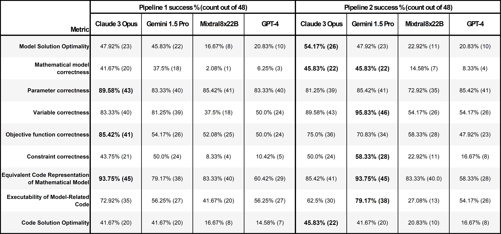

# Large Language Models for Optimization Modelling

Optimization is a collection of powerful mathematical techniques able to solve complex problems that possess a set of optimal solutions. It is a crucial part of business decision making, which so far has relied on human expertise to model and solve mathematical optimization problems. However, the emerging capabilities of Large Language Models (LLMs) offer significant potential in automating this process. This research explores the potential use of 4 LLMs —GPT-4, Gemini 1.5 Pro,  Claude 3 Opus, and Mixtral 8x22B— in being leveraged for a business optimization AI copilot. The research investigates how well these LLMs perform in formulating a mathematical model and solver code, from given natural language problem descriptions. Previous attempts at solving optimization problems with LLMs have yielded promising results but were mostly limited to simple optimization problems that are not representative of business applications. Hence, the dataset used in this research aims to achieve a real-world representation of business problems. It contains 16 problems spanning various optimization classes (Linear Programming (LP), Mixed-Integer Programming (MIP), Integer Programming (IP), and Nonlinear Programming (NLP)) and complexity levels. Key performance metrics include the correctness of the mathematical model, solution optimality, consistency, and code executability. The research investigates two pipelines, one with single-step prompting and one with Chain-of-Thought prompting, in order to compare the LLMs’ performance in different reasoning environments. Each problem was run 3 times, resulting in a total of 48 experiments in each pipeline.

The experiment results from four different LLMs reveal a mixed performance. GPT-4, although showed some promise, faced significant setbacks in binary variable definitions, complex constraint formulations and consistency of outputs. Mixtral 8x22B  struggled with identifying unwritten and implied model components, binary variable definitions and achieving consistent outputs as well. The optimal solution correctness of GPT-4 and Mixtral 8x22B were the lowest out of the 4 LLMs tested. Gemini 1.5 Pro was more successful, showing a higher optimality in results. However, it still struggled with the consistency of the outputs, similar to GPT-4 and Mixtral 8x22B. Furthermore, Claude 3 Opus showed the highest scores in achieving an optimal solution using the models formulated. However, it also had areas of failure, especially with constraint formulations. For all of the LLMs, there was no statistically significant evidence to suggest that the Chain-of-Thought prompting approach performed differently from the simpler, single-step prompting pipeline. Overall, these LLMs show promise in optimization modeling, however, significant gaps still remain in leveraging them for an AI Copilot application. An ensemble of these LLMs can be considered to utilize their different areas of expertise. 
 
The  project was a part of a BSc Business Analytics Thesis, hence the precise per-model analysis of the results can be found in the individual reports.
## Pipelines

## Experiment outcomes

 

Figure 1: A breakdown of Model and Code Solution Optimality across all individual runs. Across both pipelines only four problems were never solved correctly by any of the LLMs: IP4, MIP4, NLP3, and NLP4; only four problems were solved correctly at least once by all LLMs: IP3, LP1, and NLP1; no problem was correctly solved by all LLMs in all three runs.  

Figure 2: The Model Solution Optimality of the four LLMs for both pipelines. For all models, Model Solution Optimality was higher in pipeline 2 than in pipeline 1. Claude 3 Opus performed best in pipeline 1, followed by Gemini 1.5 Pro, GPT-4 and finally Mixtral 8x22B. In pipelines 2, Claude 3 Opus performed best, followed by Gemini 1.5 Pro and then both GPT-4 and Mixtral 8x22B.  

Figure 3: The Code Solutio Optimality of the four LLMs for both pipelines. For Claude 3 Opus, Mixtral 8x22B and GPT-4, Code Solution Optimality was higher in pipeline 2. For Gemini 1.5 Pro, Code Solution Optimality was the same in both pipelines. Claude 3 Opus and Gemini 1.5 Pro performed best in pipeline 1, followed by Mixtral 8x22B and GPT-4. In pipeline 2, Claude 3 Opus performed best, followed by Gemini 1.5 Pro, Mixtral 8x22B and GPT-4.  

Figure 4: The Solution Consistency of the four LLMs for both pipelines. For Claude 3 Opus and Mixtral 8x22B, Solution Consistency was higher in pipeline 1, for Gemini 1.5 Pro and GPT-4 Solution Consistency was higher in pipeline 2. Gemini 1.5 Pro generated the most consistent solutions per problem in pipeline 1, followed by Claude 3 Opus, Mixtral 8x22B and GPT-4. In pipeline 2, Gemini 1.5 Pro generated the most consistent solutions per problem, followed by Claude 3 Opus, GPT-4 and Mixtral 8x22B.  

Figure 5: A comparison of all evaluation metrics used throughout the research, except for solution consistency. Across the two pipelines, Claude 3 Opus achieved the highest score for six of the nine evaluation metrics: Model Solution Optimality (p2), Mathematical Model Correctness (p2), Parameter Correctness (p1), Objective Fnction Correctness (p1), Equivalent Code Representation of Mathematical Model (p1) and Code Solution Optimality (p2). Gemini 1.5 achieved the highest score in the other three metrics - Variable Correctness (p2), Constraint Correctness (p2) and Executability of Model-Related Code (p2) - and tied Claude 3 Opus for the highest score in Mathematical Model Correctness (p2) and Equivalent Code Representation of Mathematical Model (p2). 

## Characteristics of each problem in the dataset

## Sources of Optimization Problems:
1.	IP_1: Wasserkrug, S., Boussioux, L., Hertog, D. D., Mirzazadeh, F., Birbil, I., Kurtz, J., & Maragno, D. (2024). From large language models and optimization to decision optimization CoPilot: A research manifesto. arXiv preprint arXiv:2402.16269.
2.	IP_2: Kurtz, J., personal communication, April 21, 2023 (data); Cornuejols, G., & Tütüncü, R. (2006). Optimization methods in finance (Vol. 5). Cambridge University Press. https://doi.org/10.1017/9781107297340 (problem logic inspiration)
3.	IP_3: Zak, E. J. (2024). How to solve real-world optimization Problems. In SpringerBriefs in operations research. https://doi.org/10.1007/978-3-031-49838-1
4.	IP_4: STEM EZ. (n.d.). Operations Research. Retrieved May 23, 2024, from https://stemez.com/subjects/science/1HOperationsReseach/1HOperationsReseach/1HOperationsResearch/1H04-0177.htm
5.	LP_1: Poler, R., Mula, J., & Díaz-Madroñero, M. (2014). Operations Research Problems Statements and Solutions (p. 16). Springer.
6.	LP_2: MOSEK ApS. (n.d.). Robust optimization. Retrieved May 23, 2024, from https://docs.mosek.com/latest/toolbox/case-studies-robust-lo.html
7.	LP_3: Poler, R., Mula, J., & Díaz-Madroñero, M. (2014). Operations Research Problems Statements and Solutions (p. 37). Springer.
8.	LP_4: Birge, J. R., & Louveaux, F. (2011). Introduction to stochastic programming. Springer Science & Business Media. https://doi.org/10.1007/978-1-4614-0237-4
9.	MIP_1 SCIP. (n.d.). Facility location problem. In SCIP Optimization Suite documentation. Retrieved May 23, 2024, from https://scipbook.readthedocs.io/en/latest/flp.html
10.	MIP_2: Poler, R., Mula, J., & Díaz-Madroñero, M. (2014). Operations Research Problems Statements and Solutions (p. 75). Springer.
11.	MIP_3: Castillo, E., Conejo, A. J., Pedregal, P., Garcia, R., & Alguacil, N. (2011). Building and solving mathematical programming models in engineering and science. John Wiley & Sons. https://doi.org/10.1007/978-3-030-97626-2
12.	MIP_4: Poler, R., Mula, J., & Díaz-Madroñero, M. (2014). Operations Research Problems Statements and Solutions (p. 146). Springer.
13.	NLP_1: Poler, R., Mula, J., & Díaz-Madroñero, M. (2014). Operations Research Problems Statements and Solutions (p. 117). Springer.
14.	NLP_2: Poler, R., Mula, J., & Díaz-Madroñero, M. (2014). Operations Research Problems Statements and Solutions (p. 97). Springer. 
15.	NLP_3: Bracken, J., & McCormick, G. P. (1968). Selected applications of nonlinear programming (pp. 28-36). Wiley. 
16.	NLP_4: Bracken, J., & McCormick, G. P. (1968). Selected applications of nonlinear programming (pp. 37-45). Wiley.

## References:
Abdin, A. F., Fang, Y. P., Caunhye, A., Alem, D., Barros, A., & Zio, E. (2023). An optimization model for planning testing and control strategies to limit the spread of a pandemic–The case of COVID-19. European Journal of Operational Research, 304(1), 308-324. https://doi.org/10.1016/j.ejor.2021.10.062
Achiam, J., Adler, S., Agarwal, S., Ahmad, L., Akkaya, I., Aleman, F. L., Almeida, D., Altenschmidt, J., Altman, S., Anadkat, S., et al. (2023). Gpt-4 technical report. arXiv Preprint arXiv:2303.08774. https://doi.org/10.48550/arXiv.2303.08774
AhmadiTeshnizi, A., Gao, W., & Udell, M. (2023). Optimus: Optimization modeling using MIP solvers and large language models. arXiv Preprint arXiv:2310.06116. https://doi.org/10.48550/arXiv.2310.06116
Ahmed, T., & Choudhury, S. (2024). Lm4opt: Unveiling the potential of large language models in formulating mathematical optimization problems. arXiv Preprint arXiv:2403.01342. https://doi.org/10.48550/arxiv.2403.01342
Amarasinghe, P. T., Nguyen, S., Sun, Y., & Alahakoon, D. (2023). Ai-copilot for business optimisation: A framework and a case study in production scheduling. arXiv Preprint arXiv:2309.13218. https://doi.org/10.48550/arXiv.2309.13218
Anil, R., Dai, A. M., Firat, O., Johnson, M., Lepikhin, D., Passos, A., Shakeri, S., Taropa, E., Bailey, P., Chen, Z., Chu, E., Clark, J. H., Shafey, L. E., Huang, Y., Meier-Hellstern, K., Mishra, G., Moreira, E., Omernick, M., Robinson, K., & Ruder, S. (2023, May 17). PaLM 2 technical report. ArXiv.org. https://doi.org/10.48550/arXiv.2305.10403
Anthropic. (2023). Model card and evaluations for Claude models (tech. rep.). Anthropic. Retrieved May 30, 2024, from https://www-cdn.anthropic.com/bd2a28d2535bfb0494cc8e2a3bf135d2e7523226/Model-Card-Claude-2.pdf
Anthropic. (2024). Introducing the next generation of Claude. Introducing the next generation of Claude. https://www.anthropic.com/news/claude-3-family
Bahdanau, D., Cho, K., & Bengio, Y. (2014). Neural machine translation by jointly learning to align and translate. arXiv Preprint arXiv:1409.0473.
Bakas, N. P., Papadaki, M., Vagianou, E., Christou, I., & Chatzichristofis, S. A. (2024). Integrating LLMs in higher education, through interactive problem solving and tutoring: Algorithmic approach and use cases. In Papadaki, M., Themistocleous, M., Al Marri, K., & Al Zarouni, M. (Eds.), Information Systems. EMCIS 2023. Lecture Notes in Business Information Processing (Vol. 501). Springer, Cham. https://doi.org/10.1007/978-3-031-56478-9_2
Beltagy, I., Lo, K., & Cohan, A. (2019). SciBERT: A pretrained language model for scientific text. arXiv Preprint arXiv:1903.10676.
Benalcazar, P., Malec, M., Kaszyński, P., Kamiński, J., & Saługa, P. W. (2024). Electricity cost savings in energy-intensive companies: Optimization framework and case study. Energies, 17(6), 1307. https://doi.org/10.3390/en17061307
Besta, M., Blach, N., Kubicek, A., Gerstenberger, R., Podstawski, M., Gianinazzi, L., Gajda, J., Lehmann, T., Niewiadomski, H., Nyczyk, P., & Hoefler, T. (2024a). Graph of thoughts: Solving elaborate problems with large language models.
Besta, M., Memedi, F., Zhang, Z., Gerstenberger, R., Blach, N., Nyczyk, P., & Hoefler, T. (2024b). Topologies of reasoning: Demystifying chains, trees, and graphs of thoughts. arXiv preprint arXiv:2401.14295.
Birge, J. R., & Louveaux, F. (2011). Introduction to stochastic programming. Springer Science & Business Media. https://doi.org/10.1007/978-1-4614-0237-4
Boiko, D. A., MacKnight, R., & Gomes, G. (2023). Emergent autonomous scientific research capabilities of large language models.
Bracken, J., & McCormick, G. (1968). Selected applications of nonlinear programming. https://apps.dtic.mil/sti/pdfs/AD0679037.pdf
Brown, T., Mann, B., Ryder, N., Subbiah, M., Kaplan, J. D., Dhariwal, P., Neelakantan, A., Shyam, P., Sastry, G., Askell, A., ... & Amodei, D. (2020). Language models are few-shot learners. Advances in Neural Information Processing Systems, 33, 1877–1901. https://proceedings.neurips.cc/paperfiles/paper/2020/file/1457c0d6bfcb4967418bfb8ac142f64a-Paper.pdf
Bynum, M. L., Hackebeil, G. A., Hart, W. E., Laird, C. D., Nicholson, B. L., Siirola, J. D., Watson, J.-P., & Woodruff, D. L. (2021). Pyomo — Optimization modeling in Python (3rd ed.).
Castillo, E., Conejo, A. J., Pedregal, P., Garcia, R., & Alguacil, N. (2011). Building and solving mathematical programming models in engineering and science. John Wiley & Sons. https://doi.org/10.1007/978-3-030-97626-2
Chen, M., Tworek, J., Jun, H., Yuan, Q., de Oliveira Pinto, H. P., Kaplan, J., Edwards, H., Burda, Y., Joseph, N., Brockman, G., Ray, A., Puri, R., Krueger, G., Petrov, M., Khlaaf, H., Sastry, G., Mishkin, P., Chan, B., Gray, S., ... Zaremba, W. (2021). Evaluating large language models trained on code. arXiv preprint arXiv:2107.03374. https://doi.org/10.48550/arXiv.2107.03374
Chowdhery, A., Narang, S., Devlin, J., Bosma, M., Mishra, G., Roberts, A., Barham, P., Chung, H. W., Sutton, C., Gehrmann, S., Schuh, P., Shi, K., Tsvyashchenko, S., Maynez, J., Rao, A., Barnes, P., Tay, Y., Shazeer, N., Prabhakaran, V., & Reif, E. (2022). PaLM: Scaling language modeling with Pathways. arXiv preprint arXiv:2204.02311. https://arxiv.org/abs/2204.02311
Chronopoulou, A., Baziotis, C., & Potamianos, A. (2019). An embarrassingly simple approach for transfer learning from pretrained language models. arXiv preprint arXiv:1902.10547.
Chu, Z., Ni, S., Wang, Z., Feng, X., Li, C., Hu, X., Xu, R., Yang, M., & Zhang, W. (2024).
Cobbe, K., Kosaraju, V., Bavarian, M., Chen, M., Jun, H., Kaiser, L., Plappert, M., Tworek, J., Hilton, J., Nakano, R., & Schulman, J. (2021). Training verifiers to solve math word problems. arXiv preprint arXiv:2110.14168. https://doi.org/10.48550/arxiv.2110.14168
Cornuéjols, G., & Tütüncü, R. (2006). Optimization methods in finance (Vol. 5). Cambridge University Press. https://doi.org/10.1017/9781107297340
Cornuéjols, G., Peña, J., & Tütüncü, R. (2018). Linear programming: Theory and algorithms. In Optimization methods in finance (pp. 11–34). Cambridge University Press.
Dantzig, G. B. (1990). Origins of the simplex method. In A history of scientific computing (pp. 141–151).
De Angelis, L., Baglivo, F., Arzilli, G., Privitera, G. P., Ferragina, P., Tozzi, A. E., & Rizzo, C. (2023). ChatGPT and the rise of large language models: The new AI-driven infodemic threat in public health.
den Hertog, D., Ergun, O., Goncalves, R., Peters, K., Fleuren, H., Freeman, M., Kavelj, M., & Silva, S. (2019, May 7). The Nutritious Supply Chain: Optimizing Humanitarian Food Aid. Optimization-Online.org. https://optimization-online.org/2019/05/7198/
Devlin, J., Chang, M. W., Lee, K., & Toutanova, K. (2018). Bert: Pre-training of deep bidirectional transformers for language understanding. arXiv preprint arXiv:1810.04805.
Dodge, J., Ilharco, G., Schwartz, R., Farhadi, A., Hajishirzi, H., & Smith, N. (2020). Fine-tuning pretrained language models: Weight initializations, data orders, and early stopping. arXiv preprint arXiv:2002.06305.
Dong, Q., Li, L., Dai, D., Zheng, C., Wu, Z., Chang, B., ... & Sui, Z. (2022). A survey on in-context learning. arXiv preprint arXiv:2301.00234.
Fan, Z., Ghaddar, B., Wang, X., Xing, L., Zhang, Y., & Zhou, Z. (2024). Artificial Intelligence for Operations Research: Revolutionizing the Operations Research Process. arXiv (Cornell University). https://doi.org/10.48550/arxiv.2401.03244
Gangwar, N., & Kani, N. (2022, December 26). Highlighting named entities in input for auto-formulation of optimization problems. arXiv.org. https://arxiv.org/abs/2212.13201
Gemini Team, Google. (2024). Gemini 1.5: Unlocking multimodal understanding across millions of tokens of context.
Google Research. (2023). PaLM 2: Technical report. Google.
Google, Anil, R., Borgeaud, S., Wu, Y., Alayrac, J.-B., Yu, J., Soricut, R., Schalkwyk, J., Dai, A. M., Hauth, A., Millican, K., Silver, D., Petrov, S., Johnson, M., Antonoglou, I., Schrittwieser, J., Glaese, A., Chen, J., Pitler, E., & Lillicrap, T. (2023, December 18). Gemini: A family of highly capable multimodal models. arXiv.org. https://doi.org/10.48550/arXiv.2312.11805
Google. (2024). Gemini 1.5: Unlocking multimodal understanding across millions of tokens of context. arXiv.org. https://arxiv.org/pdf/2403.05530
Google. (n.d.). Documentation of Gemini models. Google AI for Developers. Retrieved May 31, 2024, from https://ai.google.dev/gemini-api/docs/models/gemini
Gurobi Optimization, LLC. (n.d.). Gurobi optimizer. Retrieved May 26, 2024, from https://www.gurobi.com/solutions/gurobi-optimizer/
Hart, W. E., Watson, J.-P., & Woodruff, D. L. (2011). Pyomo: Modeling and solving mathematical programs in Python. Mathematical Programming Computation, 3(3), 219–260. https://doi.org/10.1007/s12532-011-0026-8
He, J., Vignesh, S., Kumar, D., Uppal, A., et al. (2022). Linear programming word problems formulation using ensemblecrf ner labeler and t5 text generator with data augmentations. arXiv preprint arXiv:2212.14657. https://doi.org/10.48550/arXiv.2212.14657
Hendrycks, D., Burns, C., Basart, S., Zou, A., Mazeika, M., Song, D., & Steinhardt, J. (2020). Measuring massive multitask language understanding. arXiv preprint arXiv:2009.03300.
Hoffmann, J., Borgeaud, S., Mensch, A., Buchatskaya, E., Cai, T., Rutherford, E., Casas, D. de L., Hendricks, L. A., Welbl, J., Clark, A., Hennigan, T., Noland, E., Millican, K., Driessche, G. van den, Damoc, B., Guy, A., Osindero, S., Simonyan, K., Elsen, E., & Rae, J. W. (2022). Training compute-optimal large language models. arXiv:2203.15556. https://arxiv.org/abs/2203.15556
Hsiao, S. (2024, May 14). Get more done with Gemini: Try 1.5 Pro and more intelligent features. Google. https://blog.google/products/gemini/google-gemini-update-may-2024/#context-window
Hu, E. J., Shen, Y., Wallis, P., Allen-Zhu, Z., Li, Y., Wang, S., ... & Chen, W. (2021). LoRA: Low-rank adaptation of large language models. arXiv preprint arXiv:2106.09685.
Huang, Y., Zhang, W., Feng, L., Wu, X., & Tan, K. C. (2024). How multimodal integration boosts the performance of LLM for optimization: Case study on capacitated vehicle routing problems. arXiv preprint arXiv:2403.01757. https://doi.org/10.48550/arXiv.2403.01757
Jang, S. (2022). Tag embedding and well-defined intermediate representation improve auto-formulation of problem description. arXiv preprint arXiv:2212.03575. https://doi.org/10.48550/arXiv.2212.03575
Kim, J., & Reed, J. L. (2010). OptORF: Optimal metabolic and regulatory perturbations for metabolic engineering of microbial strains. BMC Systems Biology, 4(1). https://doi.org/10.1186/1752-0509-4-53
Land, A. H., & Doig, A. G. (1960). An automatic method of solving discrete programming problems. Econometrica, 28(3), 497–520. https://doi.org/10.2307/1910129
Lasdon, L. S., Waren, A. D., Jain, A., & Ratner, M. (1978). Design and testing of a generalized reduced gradient code for nonlinear programming. ACM Transactions on Mathematical Software (TOMS), 4(1), 34–50. https://doi.org/10.1145/355769.355773
Le, H., Wang, Y., Akhilesh Deepak, G., Savarese, S., & Steven. (2022). CodeRL: Mastering code generation through pretrained models and deep reinforcement learning. arXiv. https://doi.org/10.48550/arxiv.2207.01780
Lewis, M., Liu, Y., Goyal, N., Ghazvininejad, M., Mohamed, A., Levy, O., Stoyanov, V., & Zettlemoyer, L. (2019). BART: Denoising sequence-to-sequence pre-training for natural language generation, translation, and comprehension. arXiv:1910.13461. https://arxiv.org/abs/1910.13461
Li, Q., Zhang, L., & Mak-Hau, V. (2023). Synthesizing mixed-integer linear programming models from natural language descriptions. arXiv preprint arXiv:2311.15271. https://doi.org/10.48550/arXiv.2311.15271
López Espejel, J., Ettifouri, E. H., Yahaya Alassan, M. S., Chouham, E. M., & Dahhane, W. (2023). GPT-3.5, GPT-4, or BARD? Evaluating LLMs reasoning ability in zero-shot setting and performance boosting through prompts. Natural Language Processing, 100032. https://doi.org/10.1016/j.nlp.2023.100032
Manyika, J., & Hsiao, S. (2023). An overview of Bard: An early experiment with generative AI. Google Assistant and Bard. Retrieved from https://ai.google/static/documents/google-about-bard.pdf
Microsoft. (2024, January 30). Getting started with LLM fine-tuning. Microsoft Learn. https://learn.microsoft.com/en-us/ai/playbook/technology-guidance/generative-ai/working-with-llms/fine-tuning
Minaee, S., Mikolov, T., Nikzad, N., Chenaghlu, M., Socher, R., Amatriain, X., & Gao, J. (2024). Large language models: A survey. arXiv preprint arXiv:2402.06196.
Mistral AI. (2024, April 17). Cheaper, better, faster, stronger. Continuing to push the frontier of AI and making it accessible to all. Mistral.ai. https://mistral.ai/news/mixtral-8x22b/
Mizrahi, M., Kaplan, G., Malkin, D., Dror, R., Shahaf, D., & Stanovsky, G. (2023). State of what art? A call for multi-prompt LLM evaluation. arXiv preprint arXiv:2401.00595.
MOSEK. (2024). 11.3 robust linear optimization — MOSEK optimization toolbox for MATLAB 10.2.0. Retrieved May 23, 2024, from https://docs.mosek.com/latest/toolbox/case-studies-robust-lo.html
Naveed, H., Khan, A. U., Qiu, S., Saqib, M., Anwar, S., Usman, M., Akhtar, N., Barnes, N., & Mian, A. (2023, August 18). A comprehensive overview of large language models. ArXiv.org. https://doi.org/10.48550/arXiv.2307.06435
Naveed, H., Khan, A. U., Qiu, S., Saqib, M., Anwar, S., Usman, M., Akhtar, N., Barnes, N., & Mian, A. (2023). A comprehensive overview of large language models. arXiv preprint arXiv:2307.06435. https://doi.org/10.48550/arXiv.2307.06435
Ning, Y., Liu, J., Qin, L., Xiao, T., Xue, S., Huang, Z., Liu, Q., Chen, E., & Wu, J. (2023). A novel approach for auto-formulation of optimization problems. arXiv preprint arXiv:2302.04643. https://doi.org/10.48550/arXiv.2302.04643
Omran, S. M., El-Behaidy, W. H., & Youssif, A. A. (2023). Optimization of cryptocurrency algorithmic trading strategies using the decomposition approach. Big Data and Cognitive Computing, 7(4), 174. https://doi.org/10.3390/bdcc7040174
OpenAI. (2022, November 30). Introducing ChatGPT. Openai.com. https://openai.com/index/chatgpt/
OpenAI. (2023). Data Analyst. Retrieved May 26, 2024, from https://chatgpt.com/g/g-HMNcP6w7d-data-analyst
OpenAI. (2023, March 14). GPT-4. Openai.com.
OpenAI. (2024, March). GPT-4 technical report. OpenAI.
OpenAI. (2024, May). GPT-4O. OpenAI. Retrieved from https://openai.com/index/hello-gpt-4o/
Ouyang, L., Wu, J., Jiang, X., Almeida, D., Wainwright, C., Mishkin, P., ... & Lowe, R. (2022). Training language models to follow instructions with human feedback. Advances in Neural Information Processing Systems, 35, 27730-27744.
Pan, L., Saxon, M., Xu, W., Nathani, D., Wang, X., & Wang, W. Y. (2023). Automatically correcting large language models: Surveying the landscape of diverse self-correction strategies. arXiv preprint arXiv:2308.03188. https://doi.org/10.48550/arXiv.2308.03188
Pedroso, J. P., Rais, A., Kubo, M., & Muramatsu, M. (2019). Facility location problems – mathematical optimization: Solving problems using Gurobi and Python. Retrieved May 23, 2024, from https://scipbook.readthedocs.io/en/latest/flp.html
Poler, R., Mula, J., & Díaz-Madroñero, M. (2014). Operations research problems. Springer eBooks. https://doi.org/10.1007/978-1-4471-5577-5
Prompt Shell Smith. (2023). Code Copilot. Retrieved May 26, 2024, from https://chatgpt.com/g/g-2DQzU5UZl-code-copilot
Radford, A., & Narasimhan, K. (2018). Improving language understanding by generative pre-training.
Raffel, C., Shazeer, N., Roberts, A., Lee, K., Narang, S., Matena, M., Zhou, Y., Li, W., & Liu, P. J. (2020). Exploring the limits of transfer learning with a unified text-to-text transformer. Journal of Machine Learning Research, 21(140), 1–67.
Raj, H., Rosati, D., & Majumdar, S. (2022). Measuring reliability of large language models through semantic consistency. arXiv preprint arXiv:2211.05853. https://doi.org/10.48550/arXiv.2211.05853
Ramamonjison, R., Yu, T. T., Li, R., Li, H., Carenini, G., Ghaddar, B., He, S., Mostajabdaveh, M., Banitalebi-Dehkordi, A., Zhou, Z., & Zhang, Y. (2023, March 26). NL4Opt Competition: Formulating optimization problems based on their natural language descriptions. ArXiv.org. https://doi.org/10.48550/arXiv.2303.08233
Ramamonjison, R., Yu, T. T., Xing, L., Mostajabdaveh, M., Li, X., Fu, X., Han, X., Chen, Y., Li, R., Mao, K., et al. (2023). LaTeX2Solver: A hierarchical semantic parsing of LaTeX document into code for an assistive optimization modeling application. In D. Bollegala, R. Huang, & A. Ritter (Eds.), Proceedings of the 61st Annual Meeting of the Association for Computational Linguistics (Volume 3: System Demonstrations) (pp. 471–478). Association for Computational Linguistics. https://doi.org/10.18653/v1/2023.acl-demo.45
Reid, M., Savinov, N., Teplyashin, D., Lepikhin, D., Lillicrap, T., Alayrac, J.-b., Soricut, R., Lazaridou, A., Firat, O., Schrittwieser, J., et al. (2024). Gemini 1.5: Unlocking multimodal understanding across millions of tokens of context. arXiv preprint arXiv:2403.05530. https://doi.org/10.48550/arXiv.2403.05530
Sakaguchi, K., Bras, R. L., Bhagavatula, C., & Choi, Y. (2021). Winogrande: An adversarial winograd schema challenge at scale. Communications of the ACM, 64(9), 99–106. https://doi.org/10.1145/3474381
Sarker, L., Downing, M., Desai, A., & Bultan, T. (2024). Syntactic robustness for LLM-based code generation. arXiv preprint arXiv:2404.01535. https://doi.org/10.48550/arXiv.2404.01535
Schulz, J. (2021). Applying mathematical optimization in practice. Operations Research Forum, 2(1). https://doi.org/10.1007/s43069-020-00046-9
Shazeer, N., Mirhoseini, A., Maziarz, K., Davis, A., Le, Q., Hinton, G., & Dean, J. (2017). Outrageously large neural networks: The sparsely-gated mixture-of-experts layer. arXiv:1701.06538. https://arxiv.org/abs/1701.06538
Sider. (2023). Scholar GPT. Retrieved May 26, 2024, from https://chatgpt.com/g/g-kZ0eYXlJe-scholar-gpt
Singh, A. (2012). An overview of the optimization modelling applications. Journal of Hydrology, 466, 167–182. https://doi.org/10.1016/j.jhydrol.2012.08.004
StemEZ. (n.d.). Problem 04 – 0177 — STEM EZ. Retrieved May 23, 2024, from https://stemez.com/subjects/science/1HOperationsReseach/1HOperationsReseach/1HOperationsResearch/1H04-0177.htm
Stok, D. (2022). Optimization truck loading and scheduling. A thesis for PostNL [Master’s thesis, Erasmus University Rotterdam]. Erasmus University Thesis Repository. http://hdl.handle.net/2105/62818
Team, G., Anil, R., Borgeaud, S., Wu, Y., Alayrac, J. B., Yu, J., ... & Ahn, J. (2023). Gemini: A family of highly capable multimodal models. arXiv preprint arXiv:2312.11805.
Thompson, A. D. (2024, March). The memo - special edition: Claude 3 opus. Retrieved May 29, 2024, from https://lifearchitect.substack.com/p/the-memo-special-edition-claude-3
Toloka Team. (2023, June 26). The history, timeline, and future of LLMs. Toloka. Retrieved from https://toloka.ai/blog/history-of-llms/#a-closer-look-at-how-gpt-llms-have-evolved-over-time
Touvron, H., Martin, L., Stone, K., Albert, P., Almahairi, A., Babaei, Y., Bashlykov, N., Batra, S., Bhargava, P., Bhosale, S., Bikel, D., Blecher, L., Ferrer, C. C., Chen, M., Cucurull, G., Esiobu, D., Fernandes, J., Fu, J., Fu, W., & Fuller, B. (2023, July 19). Llama 2: Open foundation and fine-tuned chat models. arXiv.org. https://doi.org/10.48550/arXiv.2307.09288
Vaswani, A., Shazeer, N., Parmar, N., Uszkoreit, J., Jones, L., Gomez, A. N., Kaiser, L., & Polosukhin, I. (2017, June 12). Attention is all you need. ArXiv.org. https://arxiv.org/abs/1706.03762
Wadhwani, S. (2024, April). Top three LLMs compared: GPT-4 Turbo vs. Claude 3 Opus vs. Gemini 1.5 Pro. Retrieved May 29, 2024, from https://www.spiceworks.com/tech/artificial-intelligence/articles/top-three-large-language-models-compared/
Wasserkrug, S., Boussioux, L., den Hertog, D., Mirzazadeh, F., Birbil, I., Kurtz, J., & Maragno, D. (2024, February 26). From large language models and optimization to Decision Optimization CoPilot: A research manifesto. ArXiv.org. https://arxiv.org/html/2402.16269v1#bib.bib15
Wei, J., Wang, X., Schuurmans, D., Bosma, M., Xia, F., Chi, E., Le, Q. V., & Zhou, D. (2022). Chain-of-thought prompting elicits reasoning in large language models. Advances in Neural Information Processing Systems, 35, 24824–24837. https://proceedings.neurips.cc/paperfiles/paper/2022/file/9d5609613524ecf4f15af0f7b31abca4-Paper-Conference.pdf
Wright, S. J. (2024). Optimization. In Encyclopedia Britannica. https://www.britannica.com/science/optimization
Xiao, Z., Zhang, D., Wu, Y., Xu, L., Wang, Y. J., Han, X., ... & Chen, G. (2023, October). Chain-of-Experts: When LLMs meet complex operations research problems. In The Twelfth International Conference on Learning Representations.
Xiao, Z., Zhang, D., Wu, Y., Xu, L., Wang, Y. J., Han, X., Fu, X., Zhong, T., Zeng, J., Song, M., & Chen, G. (2024). Chain-of-Experts: When LLMs meet complex operations research problems. OpenReview.net. https://openreview.net/forum?id=HobyL1B9CZ
Yang, C., Wang, X., Lu, Y., Liu, H., Le, Q. V., Zhou, D., & Chen, X. (2023, September 6). Large language models as optimizers. ArXiv.org. https://doi.org/10.48550/arXiv.2309.03409
Zak, E. J. (2024). How to solve real-world optimization problems. In SpringerBriefs in operations research. Springer International Publishing. https://doi.org/10.1007/978-3-031-49838-1
Zellers, R., Holtzman, A., Bisk, Y., Farhadi, A., & Choi, Y. (2019). Hellaswag: Can a machine really finish your sentence? arXiv preprint arXiv:1905.07830. https://doi.org/10.48550/arXiv.1905.07830
Zhao, W. X., Zhou, K., Li, J., Tang, T., Wang, X., Hou, Y., Min, Y., Zhang, B., Zhang, J., Dong, Z., Du, Y., Yang, C., Chen, Y., Chen, Z., Jiang, J., Ren, R., Li, Y., Tang, X., Liu, Z., & Liu, P. (2023). A survey of large language models. ArXiv:2303.18223 [Cs]. https://arxiv.org/abs/2303.18223

## Authors 
Annika Siefke, Hubert Perliński, Melis Doga Cevik, Nathan Ferchtandiker
